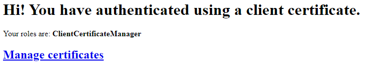
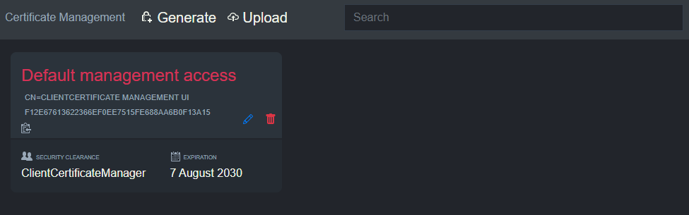

# Basic example

This example will start a site that uses client certificate authentication with an in-memory version of `IClientCertificateRepository`.

The client certificate management UI is available at `/managecertificates`.

## Setup master certificate

The example contains an example client certificate `Client Certificate Management UI example.pfx` which needs to be installed on your system such that your internet browser can use it when connecting to the site.

Windows users: add it to `user certificate store` Personal/My.

Password is `notasecret`.
