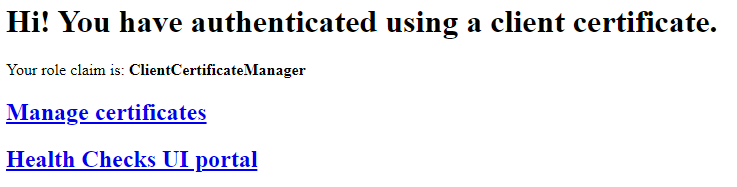
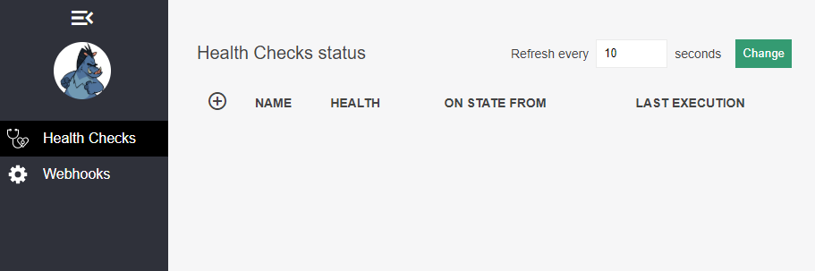

# Example with HealthChecks UI

This example will start a site that uses client certificate authentication with an in-memory version of `IClientCertificateRepository`.

The client certificate management UI is available at `/managecertificates`.

This example expands upon the basic example by adding Health Checks UI from [AspNetCore.Diagnostics.HealthChecks](https://github.com/Xabaril/AspNetCore.Diagnostics.HealthChecks). Only the UI is set up (and not collection of health check data).

The Health Check UI is available at `/healthchecks-ui`. It is authorized by an own role which can be assigned in the client certificate management UI.

## Setup master certificate

The example contains an example client certificate `Client Certificate Management UI example.pfx` which needs to be installed on your system such that your internet browser can use it when connecting to the site.

Windows users: add it to `user certificate store` Personal/My.

Password is `notasecret`.
