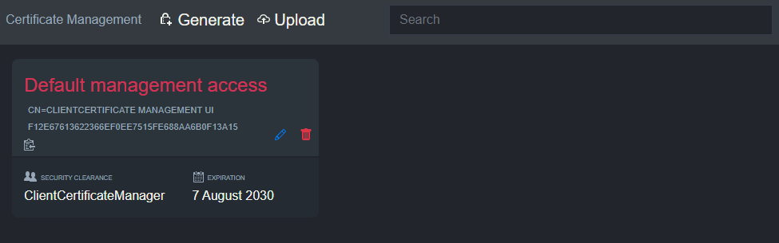

# Extended client certificate authentication with management UI for ASP.NET Core

Extended client certificate authentication = `certificate has to be registered in the store`.

## To start off

See Microsoft [Configure certificate authentication in ASP.NET Core](https://docs.microsoft.com/en-us/aspnet/core/security/authentication/certauth). This library is an extension of what Microsoft already delivers.

## A note about storage

Storage is not provided and `IClientCertificateRepository` must be implemented. The interface is quite straight forward. See the examples which include an in-memory version.

## Examples

There are two examples ready to run. See their own documentation at [Basic example](./Example.Basic/README.md) and [Extended example with Health Checks UI](./Example.HealthChecksUI/README.md). 

## Client certificate validation

What first happens is that Microsoft `Microsoft.AspNetCore.Authentication.Certificate.CertificateAuthenticationHandler` is run. Then we hook into `CertificateAuthenticationEvents.OnCertificateValidated` and do our validation logic.

A lookup is done against `IClientCertificateRepository` using `certificate thumbprint` as an identifier. Afterwards a byte comparison is done between the connection certificate and the registered one.

##  TLS phase vs Microsoft.AspNetCore.Authentication.Certificate.CertificateAuthenticationHandler

Be aware that the `CertificateAuthenticationHandler` is an ASP.NET Core middleware validating a SSL connection that is already established. The TLS phase can also reject a certificate if not found to be valid (validating the certificate chain, root certificate etc.).

## Reverse proxy

When using a reverse proxy additional steps needs to be taken to forward the certificate from the reverse proxy to the site. Please see Microsoft [Configure certificate authentication in ASP.NET Core](https://docs.microsoft.com/en-us/aspnet/core/security/authentication/certauth).

## Future enhancements slated for ASP.NET 5 (Microsoft)

In the `CertificateAuthenticationHandler` there are limitations to how much the client certificate validation can be relaxed. There is currently no way to circumvent the validation of the certificate chain. When using this library that is not important with regards to security.

See [CertificateAuthenticationHandler code](https://github.com/dotnet/aspnetcore/blob/master/src/Security/Authentication/Certificate/src/CertificateAuthenticationHandler.cs) at GitHub.

Merged pull request for .NET 5: [Allow opt-out from client certificate root checking](https://github.com/dotnet/aspnetcore/pull/15029)

Open issue: [Allow skip chain validation in ClientCertificate authentication](https://github.com/dotnet/runtime/issues/40423)
